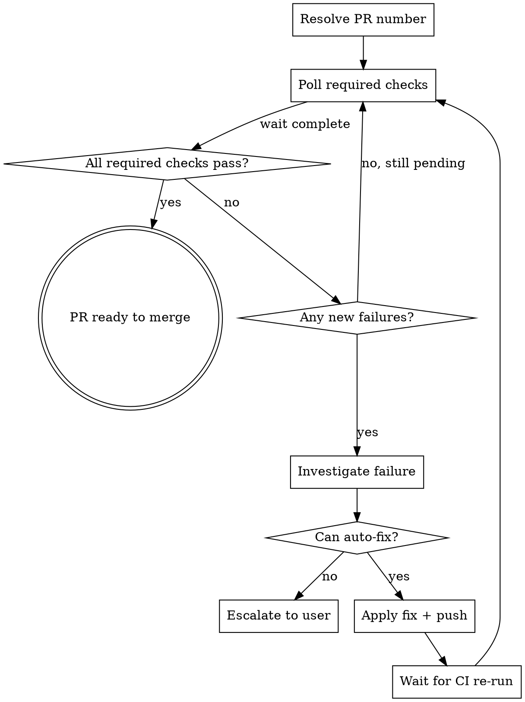

# Watch PR

Monitor a pull request's CI checks, investigate failures, apply fixes, and repeat until the PR is ready to merge or a blocker is hit that needs human input.

**Announce at start:** "Watching PR #[N] — polling CI checks."

## Process



## Step 1 — Resolve PR

If a PR number was given: `gh pr view <N> --repo semajyad/stratflow --json number,headRefName,headRefOid`

If no PR number: use current branch to find open PR via `gh pr list --head <branch>`.

## Step 2 — Poll required checks

```bash
gh api repos/semajyad/stratflow/commits/<SHA>/check-runs \
  --jq '.check_runs[] | "\(.conclusion // .status)  \(.name)"'
```

Cross-reference against required checks from the branch ruleset (Tests, E2E, Playwright fast). Non-required failures are logged but don't block.

**Wait pattern:** use background task with `run_in_background: true`:
```bash
until [ "$(gh run list --repo semajyad/stratflow --branch <branch> --json status --jq '[.[] | select(.status=="in_progress" or .status=="queued")] | length')" -eq "0" ]; do sleep 20; done
```

## Step 3 — Investigate failures

For each failing check run:
```bash
gh run view <run_id> --repo semajyad/stratflow --log-failed 2>/dev/null | tail -60
```

Classify the failure:
- **Transient infra** (runner OOM, download timeout, network): re-run the check, don't fix code
- **Lint/syntax error**: fix the PHP/JS file, commit, push
- **Test failure**: fix the source or test, commit, push
- **Workflow bug**: fix the `.github/workflows/` file, commit, push
- **Coverage gate**: add/update test file to meet 80% threshold
- **Unknown**: escalate to user with the failure log

## Step 4 — Apply fix

- Work in the worktree for the PR branch (find via `git worktree list`)
- Use `SKIP_COVERAGE_CHECK=1` only for CI-only file changes (no PHP src files)
- Use the `fix(scope):` commit prefix with a regression test staged, OR `ci:` / `chore:` for workflow-only
- Push: `git push origin <branch>`

## Step 5 — Escalate conditions

Stop watching and report to user when:
- Same check has failed **3 times** with same root cause (infinite loop risk)
- Failure requires secret/credential changes (can't auto-fix)
- Failure is in a required check we've already tried 2 fixes for
- Wall-clock time exceeds **20 minutes** without progress

Report format:
```
PR #N watch stopped — human needed.
Check: <name>
Root cause: <one sentence>
Attempted fixes: <list>
Next step: <suggestion>
```

## Step 6 — Success

When all required checks are green:
```
PR #N is ready to merge.
Required checks: ✅ Tests ✅ E2E ✅ Playwright (fast)
Optional failures (non-blocking): <list if any>
```

Then invoke the `superpowers:finishing-a-development-branch` skill if the user wants to merge.

## Hard Rules

- Never force-push — only fast-forward pushes
- Never bypass required status checks in the ruleset  
- Never modify test files to reduce coverage requirements — fix the source
- Never skip `SKIP_COVERAGE_CHECK=1` for PHP src file changes — add the test
- If a fix would take >3 files, escalate to user instead of auto-fixing

